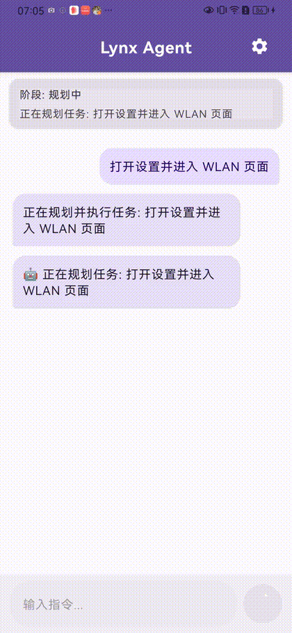

# Lynx Agent

Completion-first Android phone-use agent with evidence-based verification,
recovery, safety checks, and real-device benchmarks.

Lynx Agent turns a natural-language phone task into observable Android actions.
It uses screenshots, Accessibility, OCR, primitive tools, and an LLM runtime to
operate a real device. The key design choice is that a model saying "finished"
does not mean the task is done: every finish proposal must pass a read-only
VerifierAgent and CompletionGate before the runtime reports success.

> Status: engineering preview. The project is useful for Android agent runtime
> research, completion verification, recovery experiments, and real-device
> automation benchmarks. It is not a polished consumer assistant yet.

## Why This Exists

Most mobile-agent demos can click through a happy path. The harder problem is
knowing whether the task is actually complete, recovering after wrong actions,
and leaving a trace that explains why the agent succeeded or failed.

Lynx focuses on that harder layer:

- Evidence-based completion instead of trusting the executor's self-report.
- Vision-first Android operation using screenshots and normalized coordinates.
- Recovery when clicks, typing, app launch, or model responses fail.
- Safety confirmation for sensitive actions such as payment, deletion, submit,
  and credential-like input.
- Benchmark tooling for real-device runs, trace integrity, repeated actions,
  completion gate results, API calls, tool calls, and token usage.


## Demo



This real-device run starts from Lynx Agent, resolves Android Settings, opens the
WLAN page, proposes completion, and passes `VerifierAgent` plus
`CompletionGate` based on observable screen evidence. The MP4 version is in
[docs/assets/lynx-agent-settings-wlan-demo.mp4](docs/assets/lynx-agent-settings-wlan-demo.mp4).

## Current Capabilities

- Plans a task with `PlannerAgent` and observable success criteria.
- Executes exactly one Android tool action per round with `ExecutorAgent`.
- Captures screenshots through `MediaProjection`.
- Reads UI state through `AccessibilityService`.
- Runs Chinese OCR through ML Kit.
- Supports click, long press, scroll, drag, type, back, home, app launch, app
  resolution, and finish proposal tools.
- Stores task state, observations, actions, outcomes, verifier decisions, and
  missing evidence in `WorldState`.
- Rejects false completion through `VerifierAgent` and `CompletionGate`.
- Suspends for user help on login, verification, safety, or external blockers.
- Records trace and benchmark reports for debugging and regression review.

## Architecture

```text
User instruction
  -> PlannerAgent creates a TaskSpec and success criteria
  -> ScreenObserver captures screenshot, UI tree, OCR, app, and page signals
  -> AgentOrchestrator builds a controlled execution loop
  -> ExecutorAgent chooses one primitive action
  -> SafetyGuard allows, confirms, or blocks the action
  -> Primitive Tool performs the Android operation
  -> WorldState records outcome and evidence
  -> finished becomes FinishProposed, not success
  -> VerifierAgent checks current observable state
  -> CompletionGate accepts success or returns missing evidence
  -> Orchestrator continues, recovers, replans, asks for help, or aborts
```

See [docs/architecture-design.md](docs/architecture-design.md) for the current
runtime contract and [docs/agent-validation-platform.md](docs/agent-validation-platform.md)
for the development validation guardrails.

## Benchmark Snapshot

These are curated local benchmark snapshots from real-device runs. They are
intended as early capability signals, not a final leaderboard.

| Date | Suite | Device | Result | Notes |
| --- | --- | --- | ---: | --- |
| 2026-06-02 | `ability_cross_app_core_v9_network_restored` | `QXNUT21B09005099` | 6 / 6 | Calculator, clock, browser, file manager, and notepad tasks passed with trace integrity. |
| 2026-08-12 | `completion_smoke` | `MQS0219531003849` | 3 / 5 | Calculator, WLAN, and Bluetooth passed; Settings launch timed out; Settings battery search failed on missing tool call. |
| 2026-09-12 | `demo_settings_wlan` | `MQS0219531003849` | 1 / 1 | Settings WLAN task completed with verifier and completion gate acceptance; demo asset published under `docs/assets/`. |

More details are in [docs/benchmark-results.md](docs/benchmark-results.md).

## Quick Start

### Requirements

- Android Studio 2023.1 or newer
- Android SDK 35
- Java 11 or newer
- Kotlin 1.9.20
- A connected Android device or emulator
- An OpenAI-compatible chat completions endpoint with text and vision model
  support


### Preview APK

A debug APK is attached to the preview release for quick testing:

- [Download `lynx-agent-v0.1.0-preview-debug.apk`](https://github.com/wangjiang314/lynx-agent/releases/download/v0.1.0-preview/lynx-agent-v0.1.0-preview-debug.apk)
- [SHA-256 checksum](https://github.com/wangjiang314/lynx-agent/releases/download/v0.1.0-preview/lynx-agent-v0.1.0-preview-debug.apk.sha256)

This build is intended for engineering evaluation. After installing, enable the
Lynx accessibility service, grant screen capture, and configure your own
OpenAI-compatible API endpoint in the app settings.

### Build

```bash
git clone https://github.com/wangjiang314/lynx-agent.git
cd lynx-agent
./gradlew assembleDebug
```

### Test

```bash
./gradlew test --continue
```

### Install

```bash
./gradlew installDebug
```

### Device Setup

1. Open Android Settings.
2. Enable the Lynx Agent accessibility service.
3. Start screen capture when prompted.
4. Open Lynx Agent settings.
5. Configure API base URL, API key, text model, and vision model.

The app supports standard OpenAI-compatible chat completions APIs and custom
OpenAI-compatible endpoints.

## Run A Device Benchmark

Run a single manual scenario:

```bash
tools/run_device_benchmark.sh \
  --scenario-id settings_wlan \
  --instruction "打开设置并进入 WLAN 页面" \
  --duration 150 \
  --launch
```

Run a benchmark suite:

```bash
tools/run_benchmark_suite.sh \
  --suite benchmarks/suites/completion_smoke.tsv \
  --attempts 2
```

Benchmark outputs are written under `artifacts/benchmarks/` and ignored by git.


## Record Demos From Lynx Screenshots

When Lynx already owns screen capture through MediaProjection, a second recorder
can compete for the same device capture path. For demo evidence, you can record
the screenshots Lynx is already producing instead of starting Android
`screenrecord`:

```bash
ADB_BIN=/path/to/adb tools/record_internal_screenshots.sh \
  --serial <device-id> \
  --scenario-id settings_wlan \
  --duration 45 \
  --fps 2
```

The script reads the debuggable app cache via `run-as com.juwan.lynx`, pulls
`cache/screenshot.jpg` over ADB, and assembles MP4/GIF files with ffmpeg under
`artifacts/internal-recordings/`.

## Repository Layout

```text
lynx-agent/
|-- app/src/main/java/com/juwan/lynx/
|   |-- agent/        # Planner, executor, verifier, gate, orchestration
|   |-- api/          # OpenAI-compatible API clients and settings providers
|   |-- perception/   # Screenshot, UI tree, OCR, semantic screen signals
|   |-- runtime/      # Agent runtime abstraction
|   |-- safety/       # Sensitive action guardrails
|   |-- service/      # Android Accessibility and MediaProjection services
|   |-- state/        # WorldState, action outcomes, tool results
|   |-- tool/         # Primitive Android actions
|   `-- ui/           # Compose UI and settings screens
|-- benchmarks/       # TSV benchmark suites
|-- docs/             # Architecture, validation, launch, and benchmark notes
`-- tools/            # Real-device benchmark scripts
```

## Design Boundaries

Lynx is meant to improve general Android agent capability. Runtime changes
should improve observation, planning, execution, recovery, verification, safety,
traceability, or benchmark quality.

The runtime should not depend on app-specific click scripts, hardcoded business
flows, page-text special cases, fixed coordinates, or benchmark-only shortcuts.
Scenario knowledge belongs in benchmark definitions, fixtures, oracle logic, or
manual review notes.

## Roadmap

- Publish short demo videos for Settings, browser search, and note-taking tasks.
- Add selected public benchmark reports with sanitized traces.
- Stabilize structured `ToolResult` for all primitive tools.
- Extract a small recovery policy after tool results are stable.
- Add direct `USER_TEXT` assistance for login codes and user-provided values.
- Add a cockpit-style demo scenario to evaluate Android terminal agents in
  vehicle-like HMI flows.
- Explore local model components for OCR, screen classification, and action
  ranking.

## Contributing

Issues and pull requests are welcome. Good contributions improve the agent
runtime itself rather than hardcoding a single app or benchmark case.

Start with [CONTRIBUTING.md](CONTRIBUTING.md), open a focused issue, or attach a
benchmark report that shows the failure mode you want to improve.

## Security

Lynx can observe and operate an Android device. Do not run it on accounts,
screens, or tasks that contain sensitive personal data unless you understand the
runtime behavior and model endpoint being used.

Please report security concerns through the process in [SECURITY.md](SECURITY.md).

## License

Apache License 2.0. See [LICENSE](LICENSE).
