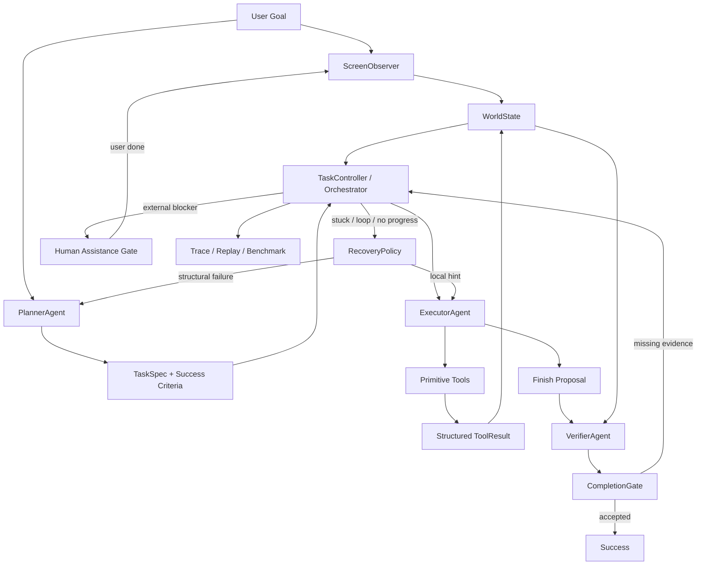

# Lynx Agent Completion-First Architecture V1

## 1. Source Of Truth

This document is the architecture truth for the next Lynx Agent runtime.

It supersedes the older runtime architecture. The approved product direction is:

1. task completion rate first
2. recovery over premature failure
3. evidence-based completion over model self-report
4. future skill extraction only after generic completion rate is high
5. no business-specific runtime hardcoding
6. vision-first minimal context over default XML or candidate-first execution

Do not preserve legacy module boundaries when they reduce completion rate.
When code conflicts with this document, move the code toward this document.

---

## 2. Product Goal

Lynx is a general-purpose Android task agent.

The user gives one natural-language goal. The system should keep working until
one of these terminal states is reached:

1. the goal is completed and verified from observable evidence
2. the task is blocked by an explicit external condition
3. the task exhausts its configured recovery budget with a traceable reason

The first release is not optimized for repeat execution, skill stability, or
minimum token cost. It is optimized for finishing open-world phone tasks.

Errors are acceptable. Unrecovered errors are not.

### 2.1 No Business Hardcoding Boundary

The runtime must improve general agent capability, not accumulate app-specific
automation patches.

Business or scenario-specific knowledge is allowed only in evaluation artifacts:

1. benchmark scenario definitions
2. deterministic oracle configs used outside the execution path
3. device/account fixtures
4. labeled examples for verifier calibration
5. manual review notes

Business or scenario-specific knowledge is not allowed in agent runtime logic:

1. app-specific workflow graphs or fixed click scripts
2. hardcoded page names, business labels, contacts, products, or content
3. special cases such as "if Settings/WLAN/Bluetooth then finish"
4. package-specific recovery branches outside primitive tool semantics
5. coordinate patches tuned to one device, app, or screen
6. prompt rules that solve one benchmark case by name instead of improving
   observation, planning, execution, verification, recovery, or tool reliability

If a benchmark only improves because runtime code recognizes a specific app,
screen, or business phrase, that result does not count as agent capability
improvement and must not be promoted to baseline.

### 2.2 Vision-First Minimal Context Boundary

Lynx is a phone-use agent, not an XML automation engine. The primary execution
path is:

```text
user goal + screenshot + small recent context -> model chooses one phone action
```

The default action interface must keep coordinate actions first-class. A valid
coordinate click must not be suppressed only because UI candidates are present.
Model-visible candidate handles are not part of the default action interface.
Internal candidates may be retained for trace, replay, oracle, debugging,
coordinate validation, recovery, and offline ablation, but they must not become
the model's action protocol.

Coordinate tools must use a single coordinate frame: the current screenshot's
0-1000 normalized coordinate frame. `click`, `long_press`, `drag`, and `scroll`
coordinates are normalized coordinates, not device pixels. Runtime must not
silently treat the same numeric pair as either pixels or normalized coordinates,
because that makes vision-model clicks land on the wrong row while looking
correct in traces.

Default model context should be minimal and directly useful:

1. original user goal and normalized task intent
2. screenshot or vision input
3. current app/package when known
4. available tools
5. last action and structured `ToolResult`
6. latest verifier missing evidence or recovery hint
7. only short, relevant text facts when they demonstrably help

The following inputs are internal by default, not default model context:

1. raw XML
2. full accessibility tree dumps
3. long OCR/UI text lists
4. long candidate lists
5. dense candidate action menus

They may be used for trace, replay, deterministic oracle, coordinate
validation, failure analysis, and observation ablation. They may enter the
runtime prompt only as a bounded, task-relevant summary and only after benchmark
evidence shows they improve completion rate without increasing false success,
repeated action, timeout, user involvement, or token cost.

Context changes are product changes. Any change that adds structure to the
model input must be evaluated as an experiment, not accepted because it looks
more engineered.

Runtime shortcut tools are also product changes. Tools that jump directly to a
specific app page or business state, such as a Settings subpage intent helper,
belong in benchmark prep, oracle code, or fixtures. They must not be exposed as
Executor runtime tools or counted as agent intelligence.

---

## 3. Success Metric

The primary metric is real task completion rate on a benchmark set of Android
tasks.

Primary metric:

1. completion rate

Secondary metrics:

1. false-success rate
2. recovery rate after wrong action
3. average steps per completed task
4. average replans per completed task
5. cost and latency
6. safety blocks and user-confirmation interrupts

A task counts as successful only when `VerifierAgent` accepts completion with
enough confidence, or when a deterministic postcondition proves completion.

---

## 4. Non-Goals For This Release

The first completion-first release does not optimize for:

1. skill mining
2. stable repeated execution
3. app-specific fixed workflow graphs
4. legacy architecture compatibility
5. minimizing the number of agents
6. minimizing LLM calls at the expense of completion rate
7. business-specific patches or page-text special cases

Skills may be added later by mining successful generic traces. A skill is a
stability artifact, not the foundation of this release.

---

## 5. Runtime Topology

The runtime is a controlled multi-agent loop:



Main components:

1. `ScreenObserver`: captures raw phone state
2. `WorldState`: stores task truth and evidence
3. `PlannerAgent`: creates and repairs high-level task strategy
4. `ExecutorAgent`: chooses one action at a time
5. `Primitive Tools`: perform phone actions
6. `VerifierAgent`: read-only completion judge
7. `CompletionGate`: accepts or rejects finish proposals
8. `RecoveryPolicy`: deterministic failure classification and budget policy
9. `Human Assistance Gate`: pauses for user help on external blockers
10. `TaskController`: owns the loop, budgets, and terminal decisions
11. `Trace / Replay / Benchmark`: measures completion rate and failure modes

The number of LLM agents is an implementation detail. Completion rate is the
design objective.

---

## 6. Agent Contracts

### 6.1 PlannerAgent

`PlannerAgent` turns the user instruction and current phone facts into a
`TaskSpec`.

It may output:

```json
{
  "goal": "string",
  "target_app": "string",
  "strategy": ["high-level milestone"],
  "success_criteria": ["observable completion condition"],
  "risk_hints": ["likely blocker or alternate route"]
}
```

Planner responsibilities:

1. understand the user goal
2. choose the likely target app
3. define high-level milestones
4. define observable success criteria
5. replan after structural failure

Planner must not output:

1. coordinates
2. fixed click sequences
3. raw tool calls
4. hidden workflow states that override observation

Planner may suggest recovery direction during replan, but execution remains
controlled by the current screen and available tools.

### 6.2 ExecutorAgent

`ExecutorAgent` is the only agent that chooses phone actions.

Executor responsibilities:

1. read the latest execution packet
2. choose exactly one action per round
3. use screenshot-first visual reasoning for screen actions
4. keep coordinate clicks as a valid primary action path
5. treat short text facts as weak hints, not as replacements for screenshot
   reasoning
6. use recovery hints when provided
7. propose finish only when it believes the goal is complete

Executor must not:

1. mark a task successful directly
2. execute multiple tools in one model round
3. ignore blocked action signatures
4. treat Planner text as screen truth
5. rely on raw XML or dense candidate lists as the default understanding path
6. auto-launch the target app before the model chooses `open_app`
7. use page-specific runtime shortcuts in place of screen understanding

When Executor emits `finished`, the runtime treats that as a finish proposal,
not as success.

### 6.3 VerifierAgent

`VerifierAgent` is a read-only completion judge.

It receives:

1. original user instruction
2. normalized goal
3. target app
4. screenshot or vision input
5. concise visible text facts when useful
6. recent actions
7. recent structured tool results
8. success criteria
9. optional short candidate or UI facts when the current verifier variant has
   been calibrated

It must output exactly:

```json
{
  "complete": false,
  "confidence": 0.0,
  "evidence": ["observable fact supporting completion"],
  "missing": ["observable fact still needed"],
  "next_hint": "short execution hint"
}
```

Verifier responsibilities:

1. reject false completion
2. explain what evidence is missing
3. provide a concise next hint when incomplete
4. accept completion only from observable evidence

Verifier must not:

1. call tools
2. plan a full new route
3. invent evidence not present in the observation
4. require irrelevant UI details not implied by the user goal

### 6.4 TaskController / Orchestrator

`TaskController` is deterministic control logic, not an LLM agent.

It owns:

1. task lifecycle
2. step budget
3. local recovery budget
4. replan budget
5. finish rejection budget
6. failure classification
7. success and abort decisions

It decides whether to:

1. continue execution
2. provide a local recovery hint
3. ask Planner to replan
4. ask Verifier to judge completion
5. ask the user to resolve an external blocker
6. terminate with success or failure

---

## 7. WorldState

`WorldState` is the runtime truth for one task.

It must store raw observation:

1. current app
2. screenshot reference or image payload
3. UI texts
4. OCR texts
5. visible texts
6. content descriptions
7. typed action candidates
8. page signature

Raw observation storage is broader than model input. XML, UI tree, OCR, and
candidate lists are allowed in `WorldState` for trace, replay, oracle, and
debugging, but they must not automatically become default prompt content.

It must store task state:

1. original instruction
2. normalized goal
3. target app
4. strategy
5. success criteria
6. task ledger
7. recovery budgets

It must store execution evidence:

1. recent actions
2. structured tool results
3. action result codes
4. page changes
5. failed action signatures
6. verifier decisions
7. completion evidence
8. missing evidence
9. stuck count

Hint fields are allowed, but they never outrank raw observation and structured
tool results.

---

## 8. Structured ToolResult

Primitive tools must return or be wrapped into a structured result.

Required internal shape:

```json
{
  "tool_name": "click",
  "args": {},
  "status": "SUCCESS",
  "changed": true,
  "target_label": "optional",
  "before_signature": "string",
  "after_signature": "string",
  "message": "short human-readable result",
  "error_type": "optional",
  "timestamp": 0
}
```

Allowed statuses:

1. `SUCCESS`
2. `NOOP`
3. `NOT_FOUND`
4. `BLOCKED`
5. `ERROR`
6. `SUPPRESSED`
7. `UNKNOWN`

ToolResult is used by:

1. WorldState updates
2. loop detection
3. recovery classification
4. Verifier evidence
5. benchmark analysis

String tool output may still exist for UI display, but runtime control must use
structured fields.

---

## 9. Primitive Tool Surface

The first completion-first runtime should keep a small, reliable tool surface.

Core tools:

1. `resolve_installed_app`
2. `open_app`
3. `click`
4. `long_press`
5. `scroll`
6. `drag`
7. `type`
8. `type_and_enter`
9. `press_back`
10. `press_home`
11. `wait`
12. `finished`

`click` with coordinates is a first-class action. The runtime must not require
candidate handles simply because internal candidates exist.

Loop recovery may suppress a proven bad action route, but it must not globally
remove a primitive tool from the model's available actions. If a business action
changes the page and a later recovery action such as `press_back`, `press_home`,
or `open_app` is required to leave that destination, the source action route is
treated as a dead end. The runtime may then suppress repeating the same coarse
route from the same source page while still allowing the model to choose a
different visible region, direction, text input, or tool.

This rule is generic. It applies to `click`, `long_press`, `scroll`, `drag`,
`type`, and `type_and_enter`. It must be keyed by coarse action shape and page
evidence, not by app name, page label, business text, benchmark scenario, or
fixed coordinate script.

`type` and `type_and_enter` should not hide a normal click as part of the
default path. A single, traceable focus recovery retry is allowed only after an
input tool fails because no editable field is focused; otherwise the model
should choose the focus click itself.

`finished` is not a real completion command. It is a proposal that triggers
`CompletionGate`.

---

## 10. CompletionGate

CompletionGate is mandatory.

Executor cannot complete a task by itself.

Completion flow:

1. Executor emits `finished`
2. TaskController refreshes observation
3. VerifierAgent evaluates completion
4. CompletionGate checks verifier output
5. if accepted, task succeeds
6. if rejected, `next_hint` is fed back into execution
7. repeated rejection triggers replan

Default acceptance rule:

1. `complete == true`
2. `confidence >= 0.80`
3. at least one evidence item is present
4. no safety or confirmation block is pending

For high-risk tasks, threshold may be raised.

For deterministic tasks, a non-LLM postcondition may accept completion, but the
postcondition must be explicit and observable.

---

## 11. RecoveryPolicy

Recovery is a first-class architecture feature.

The system should assume wrong actions will happen. The important behavior is
to notice, recover, and continue.

Recovery signals:

1. repeated `NOOP`
2. unchanged page after business action
3. looped action signature
4. missing tool call
5. unknown or invalid tool
6. app launch failure
7. target app mismatch
8. input focus failure
9. popup or permission interruption
10. verifier rejection
11. dead-end route that required recovery
12. progress stalled

Recovery levels:

1. local hint to Executor
2. local safe action such as wait, back, or popup dismissal when observable
3. alternative candidate or route
4. Planner replan
5. terminal failure only after budget exhaustion or explicit block

Default budgets should be tuned by benchmark data, not by taste. Initial
recommended defaults:

1. max task steps: 60
2. local recovery attempts per failure cluster: 3
3. global replans: 5
4. finish rejection attempts: 4
5. app launch attempts: 3
6. same action no-progress limit: 3

The runtime should prefer another reasonable attempt over aborting early.

---

## 12. Human Assistance Gate

Human assistance is a first-release completion-rate feature.

It exists for external blockers that a phone agent cannot reliably or safely
solve alone, such as:

1. captcha and slider verification
2. SMS or app-based verification codes
3. forced login or account selection
4. permission screens that require user judgment
5. payment, purchase, or irreversible confirmation
6. platform risk-control challenges

The gate should be minimal. It is not a general chat system and not a new
planning agent.

Required behavior:

1. TaskController detects an external blocker from observation, tool result, or recovery classification.
2. Execution pauses and the user is asked for one concrete action or one concrete piece of information.
3. The system records a structured assistance event in `WorldState`.
4. After the user responds or marks the action done, ScreenObserver refreshes the phone state.
5. Execution resumes from the same task with the updated observation and remaining budgets.

Minimal request types:

1. `USER_ACTION`: user manually completes something on the phone, then taps done
2. `USER_TEXT`: user provides short text such as a verification code or account value
3. `USER_CONFIRMATION`: user approves or rejects a sensitive action

The first implementation should prefer one generic `HumanAssistanceRequest`
model over many specialized tools. Specialized helpers can be added later only
when benchmarks show repeated need.

Human assistance is considered recoverable progress, not failure. A task should
abort only if:

1. the user cancels
2. the user does not respond before timeout
3. the refreshed state proves the blocker remains unresolved after the allowed attempts

Human assistance does not replace Verifier. After user help, task success still
must pass `CompletionGate`.

---

## 13. Task Ledger

`TaskLedger` is an execution-time progress model derived from user goal,
Planner success criteria, WorldState evidence, and Verifier feedback.

It should track:

1. objective
2. known target app
3. current milestone
4. completed observable conditions
5. missing observable conditions
6. failed routes
7. last verifier decision
8. next hint

The ledger is not a fixed workflow graph. It is a compact memory of what has
been tried and what evidence is still missing.

---

## 14. Execution Packet

Executor receives a compact packet every round.

Packet priority:

1. screenshot or vision input
2. original goal and current task intent
3. available tools
4. structured recent `ToolResult`
5. latest verifier missing evidence or recovery hint
6. current app/package and page signature when known
7. task ledger in compact form
8. blocked action signatures
9. short relevant visible text facts
10. optional compact candidates only when the packet variant has benchmark
    evidence
11. high-level strategy

The packet must clearly separate raw facts from hints.

The packet must not hide important failures. If the last click did nothing, the
Executor should see that directly.

The packet must not include raw XML, full UI tree, or long candidate dumps by
default. Those channels are observation-ablation variables and internal
analysis artifacts until proven useful by completion-rate evidence.

---

## 15. Main Loop

The task loop is:

```text
observe initial screen
planner.create_task_spec()
world_state.start_task()

while budget remains:
    observer.refresh()
    executor.choose_one_action()

    if action == finished:
        observer.refresh()
        verifier.verify()
        if completion_gate.accepts():
            return success
        controller.record_missing_evidence()
        if finish_rejection_budget_remains:
            continue with verifier.next_hint
        planner.replan()
        continue

    tool_result = tools.execute(action)
    world_state.update(tool_result, observation_after)

    if recovery_policy.detects_stall():
        if recovery_policy.detects_external_blocker():
            request human assistance
            observer.refresh()
            continue
        if local_recovery_budget_remains:
            continue with recovery hint
        planner.replan()
        continue

return failure_with_trace
```

Abort is the last resort, not the default result of confusion.

---

## 16. Safety

Completion-first does not mean unsafe.

The runtime must still block or request confirmation for:

1. payments
2. purchases
3. irreversible deletion
4. account changes
5. sending sensitive information
6. actions explicitly requiring user confirmation

Safety blocks must be represented in WorldState and visible to Verifier and
Planner.

If user confirmation is pending, `finished` cannot be accepted unless the user
goal was only to reach the confirmation state.

---

## 17. Benchmark And Trace

Every architecture improvement must be measurable.

The benchmark suite should include at least:

1. app launch and navigation tasks
2. search tasks
3. message composition and send tasks
4. setting toggle tasks
5. form entry tasks
6. scroll-and-select tasks
7. popup interruption tasks
8. wrong-turn recovery tasks
9. finish verification edge cases

Each run must store:

1. task instruction
2. planner spec
3. observations
4. actions
5. ToolResults
6. verifier decisions
7. human assistance events
8. replans
9. terminal status
10. failure category

Completion rate should be reported by category and overall.

---

## 18. Implementation Order

Build the new architecture in this order:

1. `TaskSpec`: extend Planner output with `success_criteria` and `risk_hints`
2. `VerifierAgent`: read-only completion judgment from goal, criteria, screenshot, texts, candidates, and recent evidence
3. `CompletionGate`: intercept every `finished` proposal before success can be reported
4. `Human Assistance Gate`: pause and resume around external blockers
5. remove Executor-local finish acceptance and finish suppression rules
6. structured `ToolResult` boundary for primitive tool execution
7. `TaskLedger`: track completed conditions, missing evidence, failed routes, and verifier feedback
8. vision-first minimal execution packet and observation-ablation variants
9. coordinate-first action validation: reject invalid/off-screen/unsafe actions,
   but do not suppress valid coordinates only because candidates exist
10. expanded `RecoveryPolicy`: local recovery, replan policy, and budgets
11. benchmark runner and trace reports
12. move scenario-specific deterministic completion checks out of runtime and
    into benchmark oracle configs
13. skill extraction from successful traces

This order maximizes completion-rate learning before adding repeatability
machinery.

---

## 19. Deferred From The First Slice

The following ideas are useful, but should not be added before the verification
ring and human assistance gate are working:

1. broad visual-coordinate fallback for every screen
2. large libraries of deterministic postcondition plugins
3. app-specific workflow graphs
4. reusable skill extraction
5. multiple specialized user-assistance tools
6. runtime patches for particular apps, pages, labels, or benchmark tasks

They can improve completion rate later, but adding them too early increases
surface area before the runtime can reliably verify and recover.

---

## 20. Deprecated From This Release

Do not optimize the first release around:

1. legacy minimalism
2. fixed app-specific task graphs
3. reusable skills as the main path
4. completion without Verifier
5. string parsing as the primary tool-result boundary
6. candidate-first execution that demotes screenshot reasoning or valid
   coordinate actions
7. raw XML or long UI tree as default model context
8. early abort after one failed route
9. app/page/business hardcoding in the runtime

The runtime should be stubborn in the useful way: verify, recover, replan, and
continue until the goal is done or the evidence says it cannot be done.

---

## 21. Current-Code Audit Decisions

The following decisions are accepted from the implementation audit and should
guide the next refactor.

### 21.1 Accepted Findings

The current implementation is missing these target components:

1. `VerifierAgent`
2. `CompletionGate`
3. `Human Assistance Gate`
4. `TaskLedger`
5. dedicated `RecoveryPolicy`
6. Planner `TaskSpec` output with `success_criteria` and `risk_hints`

The current implementation also has these completion-rate blockers:

1. finish acceptance lives inside `ExecutorAgent`
2. finish rejection is based on generic recent business-action heuristics
3. the global recovery budget is too small for real phone tasks
4. repeated-action, blocked-tool, and stuck decisions are split between Executor, ActionPolicy, and Orchestrator
5. tool wrappers may execute hidden side-effect actions such as auto-focus clicks and type retries
6. primitive tools still expose string results as the main execution boundary

### 21.2 Corrected Audit Points

Some audit claims need correction:

1. `ActionOutcome` and `ActionResultCode` already exist and already include `SUCCESS`, `NOOP`, `NOT_FOUND`, `BLOCKED`, `ERROR`, `SUPPRESSED`, and `UNKNOWN`.
2. The gap is not the absence of result codes. The gap is that primitive tools still return strings, and `WorldStateManager` derives outcomes after the fact.
3. The LLM executor path is constrained to one model-selected tool per round, but wrapper-level hidden actions can still violate the spirit of the one-action contract.
4. Auto-dismiss and auto-focus are not forbidden forever. They must become explicit controller/recovery actions or structured tool behavior visible in `ToolResult`, not hidden side effects.

### 21.3 Required Refactor Boundaries

`ExecutorAgent` must eventually own only:

1. execution packet reading
2. one model decision
3. one proposed action or finish proposal
4. no direct success decision

Move out of `ExecutorAgent`:

1. `validateFinishedDecision` -> `CompletionGate`
2. finish rejection streak logic -> `TaskController`
3. loop and no-progress classification -> `RecoveryPolicy`
4. blocked action signatures -> `RecoveryPolicy` / execution packet builder
5. hidden auto-focus and retry behavior -> explicit primitive `ToolResult` or recovery action
6. popup auto-dismiss -> explicit recovery action with its own trace and budget

### 21.4 Finish Flow Replacement

The old finish flow:

```text
Executor emits finished
Executor validates recent business evidence
Executor returns AllCompleted
Orchestrator reports success
```

must be replaced by:

```text
Executor emits finished proposal
TaskController refreshes observation
VerifierAgent evaluates current evidence
CompletionGate applies deterministic acceptance rules
if accepted: success
if rejected: record missing evidence and continue with next_hint
if repeatedly rejected: Planner replan
```

`ExecutorAgent` must not convert `finished` into `AllCompleted` directly.

### 21.5 Planner Schema Migration

The next Planner schema is:

```json
{
  "goal": "string",
  "target_app": "string",
  "strategy": ["high-level milestone"],
  "success_criteria": ["observable condition"],
  "risk_hints": ["likely blocker or alternate route"]
}
```

During migration, code may keep the existing `Strategy` type only as a
compatibility adapter, but runtime truth should move to `TaskSpec`.

### 21.6 WorldState Migration

`WorldState` must add or reference:

1. original instruction
2. target app
3. success criteria
4. task ledger
5. verifier decisions
6. completion evidence
7. missing evidence
8. failed action signatures
9. structured budget state
10. structured recent ToolResults

Existing `ActionOutcome` can be reused as a bridge, but it should not be the
final ToolResult model.

### 21.7 Recovery Budget Policy

Replace one global recovery counter with separate budgets:

1. max task steps: 60
2. local recovery attempts per failure cluster: 3
3. global replans: 5
4. finish rejection attempts: 4
5. app launch attempts: 3
6. same-action no-progress limit: 3

`STUCK_THRESHOLD`, `LOOP_DETECTED`, `PROGRESS_STALLED`, `NO_TOOL_CALL`,
`UNKNOWN_TOOL`, `APP_NOT_FOUND`, `LAUNCH_FAILED`, and verifier rejection are all
recoverable signals before terminal failure.

### 21.8 First Implementation Slice

The first code slice should be small and measurable:

1. add `TaskSpec` while preserving compatibility with existing `Strategy`
2. add `VerifierAgent` with strict JSON parsing and fallback incomplete result
3. add `CompletionGate`
4. add one generic `HumanAssistanceRequest` path for external blockers
5. route `finished` through `TaskController`/Orchestrator to Verifier
6. remove direct `AllCompleted` return from Executor finish handling
7. persist verifier and human-assistance summaries in `WorldState`
8. add unit tests for accepted completion, rejected completion, low confidence, missing evidence, and user-assisted resume

This slice is the highest expected completion-rate improvement because it
attacks false success, false failure, and externally blocked tasks at the task
boundary.
